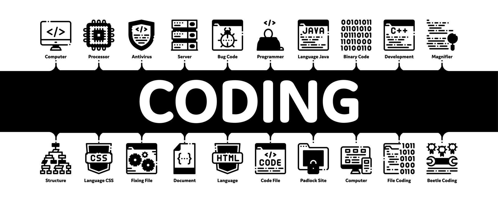

  
  
  
  
  
  
  

<h2>👤 About Me</h2>

<h3>Hey there 👋</h3>

<ul>
    <li> 😎 I’m Pouya, a Mid-Level Front-End Developer | Vue.js & Nuxt.js Specialist | 3D Web Animations</li>
    <li> 💬 Let's talk about pixel-perfect and high-performance web applications.</li>
</ul>

<h2>⌨️ Skills</h2>
  

    
    
    
    
    
    
    
    
    
  

